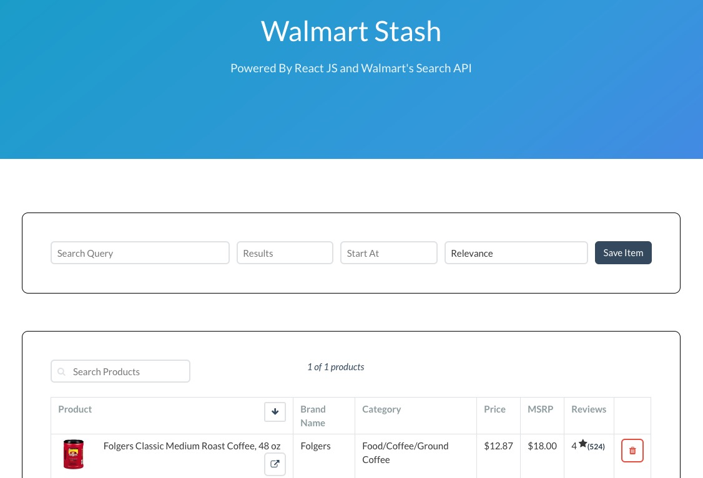
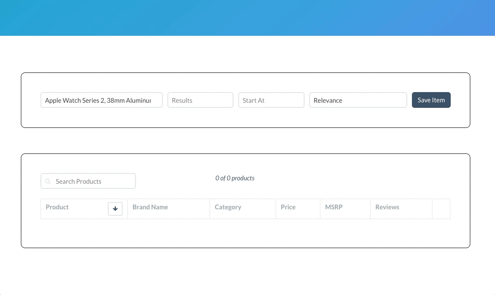

# :department_store: Walmart React App :department_store:


### :zap: Links :zap:
[Heroku Link](https://walmart-react.herokuapp.com/)  
[Trello Board](https://trello.com/b/Nzh9mvgy/walmart-react)  

***

  

***

## :running: How To Run :running:

1. `clone` repo to desktop
2. Open terminal and `cd` into `walmart-react`
3. In terminal, run `yarn install` or `npm install` to download dependencies
4. **IMPORTANT** Make sure an **API KEY** is obtained!
    - Must have a `hide.js` file placed in the root of the `src` folder.
    - Key can be obtained from Walmart (for FREE) or contact me.
    - Inside `hide.js` have key stored in `module.exports` object like so:
        ```
        module.exports = {
            KEY: 'API_KEY_HERE'
        }
        ```
5. Run `yarn start` and application will be running in `localhost: 3000`

***

## :book: General Info :book:

An application that utilizes the Walmart Search API to pull in the store's product database.

*This project was done for a coding test for a React JS position*  

*Alotted time was a week*  

#### :floppy_disk: Technologies :floppy_disk:

- [Bulma CSS](http://bulma.io/)
- [***`create-react-app` CLI***](https://github.com/facebookincubator/create-react-app)
- React JS
    - Radium
    - React Animations
- [Walmart Search API](https://developer.walmartlabs.com/docs/read/Search_API)
- [UPCitemDB](http://www.upcitemdb.com/)
- [cors-now](https://cors.now.sh/)

***

## :key: The App :key:

#### Features
- Makes search requests to the Walmart Search API
- Store items in local storage
- Sort items alphabetically
- Delete items from list
- Edit brand names
    - A brand name will be suggested

***

## :pencil: Planning :pencil:

[Wireframe](https://app.moqups.com/indieslap/ilZbWZIs43/view/page/a0d4dc3eb)  
[Trello Board](https://trello.com/b/Nzh9mvgy/walmart-react)  

At first, I had thought I needed a backend since the `Walmart Search API` was giving CORs errors when making requests on the client. This was immediately fixed when I stumbled upon the [cors-now](https://cors.now.sh/) tool that fixed my issues.  

Was tempted to use existing React table components that are out there, but opted to create one on my own with my own set of functions.  

***

## :checkered_flag: Functionality :checkered_flag:




***

## :pensive: Short Comings :pensive:

##### Wonky Search
Input seems to be one character behind, and some finagling is needed to get correct search term entered and populate results.

##### Could Have Better State Management
Not an issue when interacting with `UserResults` component, but when adding a new item with the `SearchBar` component, the `results` are not refreshed. Could be fixed by having the parent component handle the state and pass down the results to each component.

##### Huge Components
The application stems from two components, and there is **A LOT** of code between just the two, so breaking them up into smaller ones and refactoring would be in the works.

***

## :white_check_mark: To-Do's :white_check_mark:

##### **REFACTORING**
As always, code could be much shorter. There are a few sections in the application where functional programming and higher-order-functions can cut down on the amount of code.

##### **Notifications**
Add a proper notification system to notify user when actions were performed successfully or errors were made and how to fix them.

Ideally I'd like to use the [React Notification System](https://github.com/igorprado/react-notification-system) package to do this.

##### **REDUX**
Been meaning to learn it, but this will greatly help state management.

*** 

## v2  [5/26/2017]  

***didn't get position :pensive:, will work on this to scrub out the kinks and bugs for portfolio***  

***tempted to add a database to this, most likely mongoDB***  

#### Refactoring The Table  

Planning to use `react-table` to create the table. 
